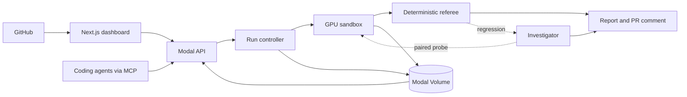

# inferval

Inferval verifies performance and behavior changes in inference code on real
GPUs. It compares a base revision with a candidate under the same hardware,
inputs, weights, and runtime conditions, then returns a deterministic verdict
with the evidence behind it.

Developers can start reviews from the web dashboard or through the hosted MCP
server. Repositories define a small suite of evals with commands and thresholds.
Inferval chooses the relevant evals, runs the paired experiment in an isolated
Modal GPU sandbox, and records metrics, logs, outputs, and telemetry.

The verdict is computed by regular policy code. When a run regresses, a bounded
investigator can inspect the evidence and request another paired probe, but it
cannot change the verdict.

## Architecture



The frontend is a Next.js application using shadcn/ui and TanStack Query. The
backend runs on Modal: a FastAPI service accepts reviews, a controller owns the
run lifecycle, and isolated GPU sandboxes execute base and candidate blocks in
an interleaved `A → B → B → A` order. Run specifications, event streams,
artifacts, verdicts, and reports persist in a Modal Volume.

## Development

The frontend lives in `web/`:

```bash
cd web
npm install
npm run dev
```

Set `NEXT_PUBLIC_INFERVAL_API` to the deployed API URL when using a different
backend. The hosted MCP endpoint is available at `/api/mcp` on the frontend
deployment.

More detail is available in [the architecture notes](docs/ARCHITECTURE.md),
[implementation notes](docs/IMPLEMENTATION.md), and
[MCP setup guide](docs/mcp.md).

## Team

Built at the Greptile hackathon by Bhavya Mehrotra, Rohit Sandadi,
Sahith ([@sahith-p](https://github.com/sahith-p)), and Yogya Mehrotra.
