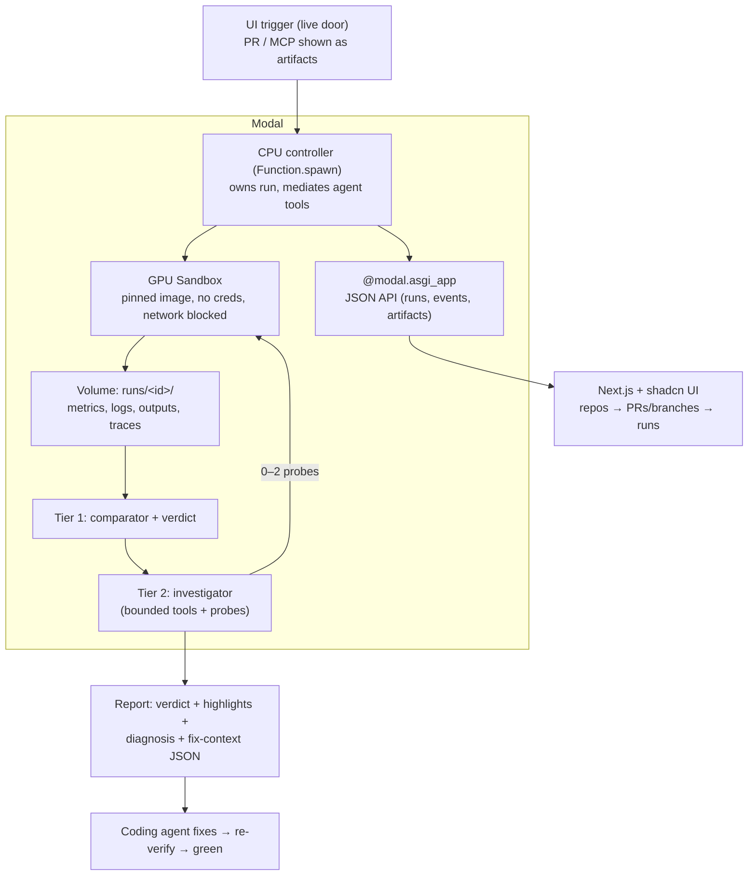

# Atlas Architecture (v2)

Design objective: repos define a suite of evals for their inference code —
like pytest, but for behavior on hardware. When code changes, Atlas runs the
relevant evals as controlled GPU experiments, issues deterministic verdicts,
and an agent plans what to measure and investigates what went wrong. The
output is a report that highlights what matters.

## 0. Eval suites and run modes

The repo declares a **suite of evals** in `atlas.yaml`. Each eval is a
scenario (a benchmark command with parameters) plus checks. This is the
pytest model applied to inference behavior: tests assert what code computes;
evals assert how it behaves on hardware — latency, throughput, memory,
output quality.

The suite is authored by a human — or **drafted by the agent**: a "Suggest
evals" action reads the repo (bench script parameters, model, hot paths)
and proposes an `atlas.yaml`, which the human reviews and commits. One
generation call, draft-and-approve like everything else; the draft can only
parameterize bench commands that already exist.

Two run modes over the same machinery:

- **compare** — base vs. candidate, paired on the same GPU, relative checks
  ("p95 must not worsen >10%"). The PR/branch-comparison flow.
- **check** — one revision against absolute checks ("p95 < 200ms", "outputs
  match golden set"). Like running the test suite on a commit: on demand, on
  main, or nightly.

**Eval selection** at run time is one field with three values, pytest
semantics: **All** (the declared suite), **Pick** (an explicit list — run
exactly those, base metrics only), or **Auto** (the agent plans evals and
extra metrics from the diff and claims). Auto is the default on PRs; All is
the default for check mode. Manual picks skip the plan call entirely.

A **base metric set** is always collected on every eval run: latency
distribution, throughput, peak VRAM, correctness, failures. Beyond that,
metrics are per-run: the agent reads the change and its claims and plans
what else to measure (see Tier 2). A PR claiming "uses less memory" gets a
memory timeline; one claiming "faster at long context" gets the long-context
eval with scaled sequence lengths. Every run does not look for the same
statistics.

## 1. The two decision tiers

This is the core design decision of v2 and the answer to "who verifies your
agent?". Every decision belongs to one tier, and the UI labels which tier
made each call.

### Tier 1 — Deterministic (owns the experiment and the verdict)

- Executes the primary paired comparison: base and candidate, sequentially,
  fresh process per block, same sandbox/GPU/image/weights/inputs/seeds,
  warmup, repeated samples, interleaved order (`base → cand → cand → base`).
- Computes metrics: output equivalence, median and p95 latency, throughput
  (tokens/sec for nanoGPT), peak allocated/reserved VRAM, failure/OOM/timeout.
- Applies declared thresholds and issues the verdict:
  - **pass** — valid comparison, no violation;
  - **regression** — valid comparison, correctness or runtime violation;
  - **invalid** — no fair judgment possible (setup/infra/environment failure).
- **Runs to completion even if the agent tier dies.** If the model call fails,
  the run still publishes the verdict with `diagnosis: inconclusive`. This is
  non-negotiable: it is the demo's safety net and the trust story.

### Tier 2 — Agent (runs the investigation, works with the machinery)

The split is not "agent locked in a box." Policy owns **fairness and the
verdict**; the agent owns **experiment strategy**. They work together: the
deterministic runner is the instrument, the agent is the scientist using it.
Every experiment the agent launches executes through the same paired runner,
so its results stay comparable and fair no matter what it decides.

What the agent genuinely decides:

- **the run plan, up front**: it reads the diff and the PR's claims, picks
  which evals from the suite are relevant to this change, and adds
  claim-specific metrics beyond the always-on base set (from the supported
  metric menu: phase timing, memory timeline, per-token latency, profile);
- which follow-up experiments to run, in what order, and **with what
  parameters** — sample counts, token lengths, run order, which declared
  override, profile granularity;
- whether to extend or repeat an experiment when evidence is thin;
- how to react to messy reality — a crashed block, a suspicious outlier, a
  preflight hiccup (rerun it, work around it, or report it);
- when the evidence is sufficient to stop and what it supports.

What stays fixed regardless of what the agent wants: both revisions always
run under identical conditions (fairness invariants), resource ceilings
(total GPU seconds, max experiments, wall time), the verdict thresholds, and
no code edits. Ceilings, not scripts — inside them the agent has real
freedom.

Mechanics:

- **Activation:** only on regression, anomaly, conflicting signals, or a
  near-threshold result. A clean pass never wakes it.
- **Inputs:** the frozen run spec, the verdict, metric deltas, lifecycle
  summaries, an artifact index, the diff and the PR's claim. Never raw logs
  wholesale — it retrieves bounded slices through tools.
- **Tools** (each mediated and budgeted by the controller):
  | Tool | Purpose |
  | --- | --- |
  | `read_metrics(experiment)` | raw samples and summaries |
  | `search_logs(query, revision)` | find matching retained log lines |
  | `read_log_window(artifact, start, end)` | bounded evidence slice |
  | `propose_probe(kind, params, reason)` | propose one catalog experiment; runs on approval (or instantly when `approvals: auto`) |
  | `finish(conclusion)` | structured diagnosis + confidence + flagged items |
- **Proposals, not silent execution.** The agent does not launch follow-up
  experiments directly — it *proposes* them: probe shape, parameters, and
  the reason, as a card on the run page. The user approves or denies (their
  coding agent can too, via the API). On approval the probe executes through
  the paired runner; a denied or expired proposal stays in the report as
  "proposed, not run." A per-repo/run setting `approvals: auto` skips the
  wait and runs proposals immediately — same code path, no wait. GPU budget
  is only debited when a probe actually executes.
- **Probe shapes** (what the runner knows how to execute; the agent supplies
  the parameters and the reason):
  1. **Confirmation pair** — rerun the paired scenario; agent picks sample
     count and order: is the effect repeatable or noise?
  2. **Paired profile** — torch profiler capture on both revisions; agent
     picks iteration count: where did the time move (host vs GPU, phase)?
  3. **Declared override pair** — a repo-approved config switch applied to
     both sides; agent picks which and its value: does the effect isolate?
  Parameters are validated against ceilings (max samples, max trace size),
  not against a script.
- **Ceilings, enforced outside the model:** total GPU seconds, max
  experiments (~3), max tool turns, wall time. Exhaustion → finish with what
  it has, honestly marked inconclusive if that's the truth.
- **Output:** observations (each linked to an artifact), hypotheses marked
  supported/rejected/inconclusive, a diagnosis with confidence, and the
  machine-readable fix-context bundle for the coding agent.

Why an agent at all (the honest version, for Q&A): the verdict doesn't need
one. The *diagnosis* does — reading stderr, deciding whether a red number is
noise, choosing which follow-up discriminates between explanations. That's
labor a human currently does; the agent absorbs it, within rails.

### The output: a report with highlights

Every run ends in one report, rendered in the UI and as a PR comment:

1. the verdict, with the violated policies highlighted in red;
2. the main findings, as a short summary (what changed, by how much, where);
3. the diagnosis with confidence, when the investigator ran;
4. flagged items — things neither tier would call confidently (a result
   inside the noise band of a threshold, visible-but-in-tolerance output
   drift, an environment problem). These are highlighted for the reader, not
   turned into a blocking workflow;
5. evidence links for every claim.

Optional, mentioned offhand in the demo: the PR comment can ping a code
review tool (e.g. `@greptileai`) with the runtime evidence so code-level
review picks up where the hardware evidence stops.

## 2. System shape



GitHub is a destination (rendered PR comment), not the runtime. The entire
product — controller, sandbox, storage, UI — runs on Modal.

## 3. Run lifecycle

1. UI submit → controller spawned (`Function.spawn`), run ID returned.
2. Controller validates config against the suite.
3. **Run plan**: the agent reads the diff and claims, selects the relevant
   evals and extra metrics (visible in the trace as `plan` events). Check
   mode with no diff skips this and runs the declared suite as-is.
4. GPU sandbox created; revisions materialized (`/base`, `/head` for
   compare; one tree for check).
5. Preflight (import + one tiny inference) before real measurement.
6. Planned evals execute (paired blocks in compare mode); every step appends
   to `events.jsonl`.
7. Tier 1 verdicts computed per check and published.
8. If warranted, Tier 2 investigation: observe → probe(s) → diagnose.
9. Report rendered (human Markdown + machine JSON); artifacts indexed.
10. Sandbox terminated in `finally`. Evidence persists on the Volume.
11. A fix commit re-enters at step 1; the green run references the red one.

## 4. Contracts (frozen before parallel work)

Keep these to the minimum that lets four agents build in parallel. Plain
dicts validated loosely — no schema ceremony.

### 4.1 `events.jsonl` entry (the UI's and investigator's shared feed)

```json
{"t": "2026-08-23T13:42:07Z", "run": "r_8f2a", "tier": "system",
 "kind": "bench_block_done", "detail": {"revision": "base", "block": 1,
 "tokens_per_s": 412.3, "p95_ms": 41.2, "peak_vram_mb": 1912}}
```

`tier` ∈ `system | policy | agent`. `kind` is an open enum; the UI
renders unknown kinds generically. Agent reasoning entries use
`kind: "observation" | "hypothesis" | "probe_launched" | "conclusion"` with a
`refs` list of artifact paths.

### 4.2 Verdict object

```json
{"run": "r_8f2a", "verdict": "regression", "policy": [
  {"metric": "tokens_per_s", "base": 412.3, "cand": 318.9, "delta_pct": -22.6,
   "threshold_pct": -10, "violated": true},
  {"metric": "output_equivalence", "result": "match", "violated": false}],
 "claim": {"text": "~2x faster generation", "verified": false}}
```

### 4.3 Investigation object

```json
{"run": "r_8f2a", "status": "completed",
 "observations": [{"id": "o1", "text": "per-token host gap grows with sequence
   length", "refs": ["experiments/e2/trace.json"]}],
 "hypotheses": [{"id": "h1", "text": "per-token host sync added in generate loop",
   "status": "supported", "refs": ["o1"]}],
 "probes": [{"kind": "profile_pair", "reason": "distinguish GPU compute from
   host stall", "experiment": "e2"}],
 "diagnosis": {"text": "regression localized to host-side per-token sync in
   generate(); GPU forward time flat", "confidence": "high"},
 "fix_context": {"base": "abc123", "cand": "def456", "suspect_paths":
   ["model.py:generate"], "evidence": ["..."], "success_condition":
   "tokens_per_s within 5% of base, outputs equivalent"}}
```

### 4.4 Repo contract (`atlas.yaml` in the target repo)

```yaml
image: <pinned registry image or Modal named image>
gpu: A10G
evals:
  generate_short:
    cmd: python bench.py --tokens 128 --out {out}
    checks: {tokens_per_s: -10%, p95_ms: +15%, peak_vram: +8%}  # compare mode
    absolute: {p95_ms: "<50"}                                    # check mode
  generate_long:
    cmd: python bench.py --tokens 1024 --out {out}
    checks: {tokens_per_s: -10%, p95_ms: +15%}
correctness: token_ids_match          # fixed seed, greedy or seeded sampling
overrides: [batch_size]               # legal probe switches
```

Every eval run collects the base metric set; the agent's run plan picks
which evals execute and which extra metrics to enable (§0).

## 5. Modal feature map (all load-bearing)

| Feature | Role |
| --- | --- |
| `Sandbox.create(image, gpu, volumes, timeout)` | isolated per-run GPU lab |
| Sandbox network blocking + no credentials | code under test can't touch the checker |
| `sandbox.exec()` | run bench processes; stream stdout/stderr |
| Pinned/named Images | prebuilt env; sandbox up in seconds |
| Volumes | weights cache + `runs/<id>/` evidence store |
| `Function.spawn()` + FunctionCall ID | background run ownership; UI polls |
| FunctionCall log `tail`/`fetch(search)` | live + searchable logs (backs `search_logs`) |
| Readiness probes | no sleep hacks |
| Timeouts + `terminate()` in `finally` | no leaked GPUs, bounded spend |
| GPU health events | hardware fault → `invalid`, not blamed on the code |
| `@modal.asgi_app()` | events API + UI served from Modal itself |
| Torch profiling pattern (Modal example) | the profile probe |

Line for the judges, and it's true: the product structurally cannot exist
without Modal — same-device paired GPU runs on demand, isolation from the
code under test, and zero self-hosted infrastructure.

## 6. UI spec (Next.js + shadcn, three levels)

Stack: Next.js (App Router) + shadcn/ui + Tailwind, talking to the
Modal-hosted JSON API. Langfuse — the open-source leader in this category —
is built on exactly this stack, so its repo is a direct visual and component
reference. Design language: minimal; a 1980s-technical-report-inspired theme
is a later polish pass, not a day-one requirement.

The page hierarchy mirrors how the product is actually used, and is not
hardcoded to the nanoGPT demo:

1. **Repos** (`/`) — the GitHub repos Atlas is connected to, each with
   status: last run verdict, runs count, configured GPU. (Demo data: the
   nanoGPT fork plus one or two placeholder repos so it reads as a platform.)
2. **Repo detail** (`/repo/<name>`) — pick a branch or PR; see its state and
   the list of runs with headline metrics (verdict badge, tokens/sec delta,
   p95 delta, VRAM delta, duration). The New Run form lives here: mode
   (compare/check) and eval selection (All / Pick with checkboxes / Auto).
   Also here: "Suggest evals" (agent drafts the suite for review), a
   "Watch PRs" toggle — auto-verifying new PRs via a polling watcher —
   shown grayed as post-MVP unless the stretch gets built, and a copyable
   **agent setup prompt** ("paste into Claude Code and it verifies its next
   change through Atlas via MCP"). This is the Datadog-style overview
   level: state at a glance, click into anything.
The product lifecycle is six verbs, used everywhere — the architecture
slide, the run page structure, and the demo script all follow it:

> **Submit → Plan → Measure → Verdict → Investigate → Verify**

Runs carry visible status chips through it (`Queued → Provisioning → Ready
→ Measuring → Verdict → Investigating → Done`) in the runs table and at the
top of the run page. Each run and proposal shows its estimated GPU cost
("this verification cost $0.14").

3. **Run detail** (`/repo/<name>/runs/<id>`) — trace spans grouped under
   the lifecycle phase headers, three sections:
   - **Verdict zone** (Braintrust convention — experiment = side-by-side
     diff): banner labeled "policy decision", the PR's claim quoted next to
     measured reality, base/candidate/delta/threshold table, violations red.
   - **Investigation trace** (Langfuse convention — trace = timed spans):
     every event as a span — sandbox up, bench blocks, verdict, then agent
     entries (observation → hypothesis → proposal → approval → probe →
     conclusion), each linking to its evidence artifact. Sandbox and GPU
     lifecycle events are first-class: this is where the backstage
     difficulty becomes visible.
   - **Proposal cards** — when the agent proposes a probe on a live run, a
     card shows the experiment, parameters, reason, and estimated GPU cost,
     with Approve / Deny buttons. An "auto-approve" toggle sits next to it
     (functional — it's the `approvals: auto` setting).
   - **Report** — the summary of findings, highlighted errors/violations,
     diagnosis with confidence, flagged items (including proposals that
     were not run), and the rendered PR comment.

Live runs poll `GET /runs/<id>/events?since=N` every 2s; completed runs
render the full feed instantly — replay quality matters more than live
polling.

## 7. Entry doors: one API, many thin clients

The REST API on Modal is the product's only real interface. Every door is a
client of it; nothing else touches Modal internals. One contract = no drift
= not jank.

- **Web UI** (human door, demo's live door): repo → branch/PR → New Run.
- **MCP server** (agent door): four tools mapping 1:1 to API endpoints —
  `submit_run(repo, base, head, evals?)`, `get_report(run_id)`,
  `approve_proposal(run_id, proposal_id)`, `list_evals(repo)`. Official MCP
  Python SDK, each tool body is one HTTP call (~100 mechanical lines). This
  is how Claude Code/Codex verify their own changes before opening a PR.
- **PR comment** (output door): rendered from the real verdict object, shown
  as an artifact ("this is what lands on the PR").
- **CLI / plugin** (later doors): the CLI is the same API client for
  humans/CI; a Claude Code or Codex plugin is just packaging around the MCP
  server. Neither is hackathon work.

Auth is a hackathon-grade shared token; say so honestly if asked.

## 8. Explicitly not built

Arbitrary-repo environment synthesis; GitHub App; multi-repo dashboards;
kernel generation or optimization (Wafer's territory — we verify, we never
write); open-ended agent autonomy; historical analytics; auth; production
fork-PR security. Named here so nobody burns a minute on them.
