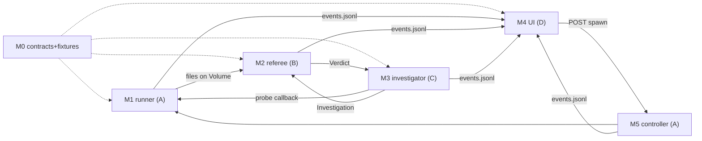

# Atlas Implementation Plan (v2)

Scope: the technical plan for the 4-hour build. No code — modules, specific
technologies, interfaces, ownership, and an adversarial review of each module
resolved inline. Companion to BUILD_PLAN.md (timeline/packets) and
ARCHITECTURE.md (contracts §4, referenced throughout as the source of truth).

## 0. Ground decisions (settle these once, first 15 minutes)

| Decision | Choice | Rationale |
| --- | --- | --- |
| Language | Python 3.11 everywhere | Modal SDK, torch, one toolchain |
| Modal SDK | One pinned version, in `requirements.txt` tonight | API drift killed teams before |
| Repo layout | One git repo, one top-level dir per module | Four agents, near-zero file overlap |
| Module linking | Modules are plain Python libraries; **only the controller imports them**; modules never import each other | Kills circular deps and merge hell |
| Data interchange | JSON files on the Volume + dicts matching ARCHITECTURE §4; no shared Python objects across modules | Agents integrate against fixtures, not against each other's code |
| Investigator harness | **OpenAI Agents SDK** (`openai-agents-python`): agent + `@function_tool` Python functions, built-in loop, `max_turns`, `output_type` structured output | Purpose-built for exactly this; kills the hand-rolled loop; Modal has an official example pairing it with Sandboxes |
| Investigator model | **OpenRouter → `ox-alpha`** (stealth preview: free, 1M context, tool calling). Wire via `OpenAIChatCompletionsModel` + `AsyncOpenAI(base_url="https://openrouter.ai/api/v1", api_key=OPENROUTER_API_KEY)`. Model ID and base URL come from env vars only | Zero cost during preview; Stripe (a judge's employer) just acquired OpenRouter — one free sentence in the pitch. Verify the exact model ID against openrouter.ai once the key exists |
| Model fallback | Any OpenAI-compatible endpoint via the same two env vars; keep ~$10 on a paid provider in reserve | ox-alpha is an unclaimed preview with no SLA — it can be pulled or rate-limited on event day. Swapping = one env change, zero code |
| Local Python | 3.13 via `uv` in `.venv` (system Python is EOL 3.9) | Torch never runs locally — GPU work happens inside Modal images with their own Python |
| UI stack | Next.js (App Router) + shadcn/ui + Tailwind, run locally (or Vercel) against the Modal JSON API | Real product feel, not demo-hardcoded HTML; Langfuse ships on this exact stack |
| Backend API | FastAPI via `@modal.asgi_app()`, JSON only, CORS open | UI and API decoupled; API stays on Modal |
| Deployment | One Modal App; A owns the deploy entrypoint that mounts everything | One `modal deploy` command, one owner |

Repo layout:

```text
atlas/
  contracts/    fixtures/*.json, contracts.py (TypedDicts only)   [frozen, shared]
  runner/       images.py, volumes.py, sandbox_mgr.py, revisions.py,
                paired_runner.py, artifacts.py                     [A]
  controller/   controller.py (thin), app.py (Modal App + deploy)  [A]
  referee/      comparator.py, policy.py, report.py                [B]
  investigator/ context.py, tools.py, loop.py, probes.py, prompts.py [C]
  api/          api.py (FastAPI, mounted by controller/app.py)     [D]
  web/          Next.js app (app/, components/, lib/api.ts)        [D]
demo/           nanoGPT fork lives on GitHub; this dir holds the PR patches,
                bench.py reference copy, atlas.yaml                 [D+A]
```

---

## M0 — Contracts and fixtures (shared, frozen at 1:15)

**What:** `contracts.py` with TypedDicts mirroring ARCHITECTURE §4 (event,
Verdict, Investigation, RunSpec/atlas.yaml) and `fixtures/` with complete
example JSONs for: clean pass; regression + investigation + probe; invalid
(malformed metrics); candidate-fail; escalation. Plus one full synthetic
`events.jsonl` for a regression run (M4 builds against this all afternoon).

**Technology:** TypedDict + a 20-line `validate(obj, kind)` helper doing key
presence checks only. No pydantic, no jsonschema — validation ceremony was
cut deliberately.

**Links:** every module reads these; nobody writes to this dir after 1:15
without all four agreeing (expect ≤2 amendments; version them by git commit).

**Review.** Risk: fixtures too thin, so integration surprises anyway →
mitigation: the regression fixture must be *complete* — every field every
consumer reads, written tonight, reviewed by all four at 1:00. Risk: someone
"improves" a contract mid-afternoon and breaks two modules → the freeze rule
plus single-commit amendments. Resolved.

---

## M1 — Runner (Person A): the lab

**What:** everything that touches Modal execution. Given a validated RunSpec,
produce raw evidence on the Volume.

**Components and responsibilities:**

- `images.py` — the nanoGPT image (torch + repo deps), built and pushed
  **tonight**, referenced by digest/name. No image building at the event.
- `volumes.py` — two Volumes: `atlas-cache` (GPT-2 124M weights, prompt
  fixtures; read-only at run time) and `atlas-runs` (`runs/<id>/...` per
  ARCHITECTURE §3; per-run dirs so writes never conflict).
- `sandbox_mgr.py` — `Sandbox.create(image, gpu, volumes, timeout)`, block
  network, readiness check (exec a trivial command, not sleep), tagged by
  run ID, `terminate()` guaranteed by the controller's `finally`.
- `revisions.py` — shallow clone of the demo fork at each SHA into `/base`
  and `/head` inside the sandbox (nanoGPT is tiny; seconds). Record resolved
  SHAs into the run dir.
- `paired_runner.py` — the protocol: preflight both sides (import + 1-token
  generate), warmup block, then measured blocks in `base→cand→cand→base`
  order, **one `sandbox.exec` per block** (fresh process = fresh CUDA
  context), env telling the bench where weights/fixtures/output live.
  Captures returncode/stdout/stderr per block; timeouts per block.
- `artifacts.py` — moves/validates per-block outputs into
  `runs/<id>/experiments/<eid>/`, appends events.

**The measurement boundary (important):** the *bench script in the target
repo* owns timing — CUDA-event/synchronized timing, seeds, peak-VRAM reset,
token-ID output — and writes a metrics JSON to a path Atlas gives it. The
runner never parses stdout for numbers and never times across process
boundaries. Atlas owns orchestration and fairness; the repo owns measurement.
This is the `atlas.yaml` contract doing real work.

**Inputs → outputs:** RunSpec dict → block metric JSONs, logs, preflight
results, events. Also exposes `run_blocks(overrides)` — the exact entry point
M3's probes reuse (a probe *is* a paired run with modified params).

**Review.** (1) Bench crash must become a structured observation (returncode,
stderr tail in the block record), never a runner exception — B's comparator
turns it into `regression` (candidate-only) or `invalid` (both). (2) Risk:
exec environment mismatch (weights path, CUDA visibility) burns 30 min —
that's exactly what tonight's manual paired run flushes out; the event-day
code must replicate tonight's known-good invocation, not invent one.
(3) Four model loads per A-B-B-A run: acceptable for GPT-2 124M (~seconds
from Volume); if the timed loop exceeds ~3 min tonight, drop to A-B-B-A with
smaller token counts, not to A-B. (4) Warm-sandbox reuse during development
(don't cold-create per test) — keep one dev sandbox alive; production path
still creates fresh. Resolved with these rules.

---

## M2 — Referee (Person B): policy, events, reporting

**What:** all pure logic. Zero Modal imports — fully testable on a laptop.

**Components:**

- `comparator.py` — block metric JSONs → per-metric aggregates (median/p95
  across blocks, correctness match, peak VRAM max) → deltas → Verdict per
  ARCHITECTURE §4.2. Tiny metric registry hardcodes direction and unit per
  metric (`tokens_per_s`: higher-better; `p95_ms`: lower-better; …).
  Ordering: validity checks → correctness → performance. Missing/malformed
  metrics file, preflight failure on both sides, or env identity mismatch →
  `invalid` with a reason string.
- `policy.py` — check evaluation from `atlas.yaml`: relative % checks for
  compare mode, absolute checks for check mode, per eval; plus the near-band
  rule (|delta| within the measured noise margin of a threshold → a flagged
  item in the report instead of a confident call).
- `report.py` — (Verdict, Investigation) → the report per ARCHITECTURE §1:
  verdict with violations highlighted, findings summary, diagnosis, flagged
  items, evidence links; rendered as report JSON (for the UI) + PR-comment
  Markdown (claim quoted vs. measured reality first, facts before diagnosis,
  optional `@greptileai` ping line).

**Links:** consumes M1's files; called only by the controller; its outputs
feed M3 (verdict), M4 (via events), and the demo assets (PR comment).

**Review.** (1) Sign/direction bugs are the classic silent killer here → the
metric registry plus fixture tests for both directions are mandatory before
checkpoint 1. (2) Correctness comparison for nanoGPT is exact token-ID match
under fixed seed — brittle if the "optimization" legitimately reorders
floating-point ops; tonight's validation must confirm the chosen regression
(and the passing PR) keep outputs bit-identical, else relax to a declared
tolerance *tonight*, not at 3 PM. (3) Near-band margin needs tonight's noise
number; ship it as a constant in `policy.py` with the value written on the
whiteboard. Resolved conditional on tonight's data.

---

## M3 — Investigator (Person C): the observer

**What:** the Tier-2 agent, built on the **OpenAI Agents SDK**: one Agent
with ~5 `@function_tool` Python functions, `max_turns` as the turn budget,
and `output_type=Investigation` so the structured conclusion comes out typed.
The SDK owns the loop; our code owns the tools and the ceilings. The agent
has real freedom inside those ceilings (per ARCHITECTURE §1 Tier 2): it picks
probe parameters, extends or repeats experiments, and reacts to failed
blocks — resource ceilings, not scripts, are what bound it.

It also owns the **run plan**: a first, cheap agent call before any GPU work
(same Agent, `output_type=RunPlan`: selected evals from the suite + extra
metrics from the menu + one sentence of reasoning per pick, emitted as
`plan` events for the trace). If the plan call fails, the controller falls
back to the full declared suite with base metrics — planning can improve a
run but never block one.

**Components:**

- `context.py` — builds the compact initial context: RunSpec summary, the
  Verdict, per-metric deltas, lifecycle timings, artifact index (paths +
  sizes only), the diff and PR claim text. Explicit cap (~4KB) so raw logs
  can't leak in.
- `tools.py` — implementations behind the tool schema in ARCHITECTURE §1:
  metric/log reads are file reads against `runs/<id>/` with line/byte bounds;
  `propose_probe` emits a `probe_proposed` event (shape, params, reason,
  estimated GPU cost), then polls an approval key in a **Modal Dict** every
  2s until Approve/Deny arrives or a timeout expires (timeout/deny → the
  tool returns "not run"; the agent continues with what it has). When
  `approvals: auto`, the key is pre-set and the poll returns immediately —
  same code path. Approved probes execute through a **callback injected by
  the controller** (in tests: a mock returning fixture results; in
  production: M1's `run_blocks`). `finish` validates the Investigation
  object shape, including flagged items and unrun proposals.
- `loop.py` — Agents SDK setup: the Agent definition, `Runner.run(...,
  max_turns=~10)`, `output_type=Investigation`. A GPU-seconds ledger lives in
  the probe callback: each `launch_probe` estimates cost, debits the ledger,
  and rejects only when the ceiling is hit — parameters inside the ceiling
  are the agent's call. On any model/API exception (incl. MaxTurnsExceeded)
  → raise `InvestigatorFailed`; the controller catches it and publishes
  `diagnosis: inconclusive` (Tier-1 survival rule lives at this boundary).
- `probes.py` — the three probe *shapes* the runner can execute
  (`confirm_pair`, `profile_pair`, `override_pair`) with parameter validation
  against ceilings (max samples, max trace size, whitelisted overrides) —
  validation bounds the agent, it doesn't script it.
- `prompts.py` — system prompt: role (experiment observer), the tier
  boundaries (you cannot change the verdict; you may escalate), the required
  output discipline (observations must cite artifact refs; hypotheses carry
  status; "inconclusive" is an acceptable answer).

**Links:** consumes M1 artifacts + M2 verdict; drives M1 via callback;
output consumed by M2's report and M4's trace.

**Review.** (1) Biggest risk in the project: loop reliability. Mitigation
order: the probe path is pre-tested tonight against the *exact* demo
scenario; the fixture-mocked loop is C's first proof at 1:45; the real-run
integration happens at 2:30 with recorded artifacts before any live wiring.
(2) The demo needs the agent to pick the *profile* probe for the hero run —
do not hard-code that, but the prompt legitimately lists what each probe
distinguishes, and the scenario (flat VRAM, matched outputs, big latency
delta) makes profile the obvious choice. If it picks confirmation first,
that's fine — budget allows both; the demo narrates whichever happened in
the recorded hero run. (3) `--profile` support must exist in bench.py
(demo-repo task, D+A) — flagged as a cross-module dependency; due before
3:15. (4) Token cost/latency: ~8 turns × ~10s worst case ≈ 80s inside a run
— acceptable; probes dominate anyway. Resolved.

---

## M4 — API + UI + demo assets (Person D): the face

**What:** the only thing judges look at. Two halves: a thin JSON API on
Modal, and a Next.js app that is the product's face.

**Components:**

- `api/api.py` — FastAPI mounted via `@modal.asgi_app()`, JSON only, CORS
  open: `GET /api/repos` (connected repos + status — demo data comes from a
  small `repos.json` plus real run scans); `GET /api/repos/{name}/runs`
  (runs with headline metrics, filterable by branch/PR);
  `GET /api/runs/{id}/events?since=N` (JSONL from line N — the polling
  cursor is a line count); `GET /api/runs/{id}/report` (report JSON);
  `GET /api/runs/{id}/artifact?path=` (bounded file serving so evidence
  links never 404); `POST /api/runs` (body: mode, base/head, optional `evals` list — null means
  Auto/plan, explicit list means run exactly those; looks up the deployed
  controller function, `.spawn()`, returns run ID); `POST /api/runs/{id}/proposals/{pid}`
  (body: approve/deny — sets the approval key in the Modal Dict the
  investigator polls).
- `web/` — Next.js App Router + shadcn/ui + Tailwind, run locally for the
  demo (Vercel optional). Three routes per ARCHITECTURE §6: repos list →
  repo detail (branch/PR picker, runs table with verdict badges and metric
  deltas) → run detail (verdict zone, investigation trace with tier-labeled
  spans, report section). shadcn gives the table/badge/card components for
  free; Langfuse's open-source repo is the direct reference for the trace
  view. `lib/api.ts` is the one file that knows the API URL (env var).
  Big fonts — this is read from the back of a judging room.
- Demo assets (after 3:45): PR-comment render, architecture slide, sped-up
  fix-loop video, full-run screen recording backup.

**Links:** reads only the API. D builds against M0's synthetic
`events.jsonl` (served by a 20-line local mock of the API) until 2:30 and
needs nothing from A/B/C before then.

**Review.** (1) Next.js is more surface than static HTML — the tradeoff is
deliberate (product feel, not demo-hardcoded), but the guardrails are: local
dev server for the demo (no deployment dependency), shadcn defaults over
custom design, the 1980s-report theme explicitly deferred, and the repos
page fed by a static `repos.json` rather than a real GitHub integration.
(2) CORS + API URL env var is a classic time sink — set both in the first
20 minutes and verify from the browser, not curl. (3) "Live feel": instant
render of completed runs + one fresh run triggered at demo start covers it;
video is the fallback. (4) `POST /api/runs` coupling to the deployed
controller name is the one integration point that can't be mocked — wire it
at checkpoint 1, not at 4 PM. (5) Volume read-after-write visibility across
containers (API container vs. controller container) can lag — controller
commits the Volume per event batch and the API reloads before reads; test
this exact path at 2:30, it is the most likely "works locally, stale on
Modal" bug in the project. Resolved with the 2:30 test obligation.

---

## M5 — Controller (Person A, thin): the sequencer

**What:** one Modal function, `spawn`ed per run. Strictly glue, target ≤150
lines: validate RunSpec → create sandbox → M1 primary → M2 verdict →
activation check → M3 (with probe callback and try/except →
inconclusive) → M2 report → write final objects → terminate sandbox in
`finally`. Emits lifecycle events at every step.

**Review.** Risk: logic creep (retries, cleverness) makes it untestable →
rule: any branch beyond sequencing belongs in a module; the activation check
is one function call into M2. Risk: partial failure leaves no evidence →
event append + artifact writes happen *before* each next step, and report
rendering runs even on `invalid`. Resolved.

---

## Demo repo (D with A, prepared tonight where rules allow)

Starting point: nanoGPT already ships `bench.py` (training-step benchmarking
with torch.compile/dtype knobs) and `sample.py` (generation). Our bench
harness adapts sample.py's generation path with bench.py's timing discipline
rather than being written from scratch.

nanoGPT fork + `bench.py` (loads GPT-2 124M from the mounted cache, fixed
prompts/seed, parameterized token count, CUDA-synchronized timing, per-token
p95, tokens/sec, peak VRAM, token IDs out, `--profile` mode, metrics JSON to
`$ATLAS_OUT`) + `atlas.yaml` declaring a **2–3 eval suite** (e.g.
`generate_short` at 128 tokens, `generate_long` at 1024 — same script,
different parameters, so the suite costs nothing extra to build) + three
branches: the regression PR (per-token host sync disguised as an
optimization, per DEMO.md), the fix, and the genuinely-good passing PR. The
regression must measure ≥5× tonight's noise floor, and it should hit
`generate_long` harder than `generate_short` — that asymmetry is what makes
the agent's run plan and diagnosis visibly smart.

**Review.** bench.py is the single most demo-critical file and is *not*
Atlas product code — it must exist and run before the event or be the very
first artifact at 1:00. `--profile` due before 3:15 (M3 dependency). Owner
ambiguity is the risk → named: D writes it, A validates it inside the image
tonight.

---

## Integration map



Four seams, four tests, in order: **(1)** M1→M2 at 2:00–2:30 (real GPU files
→ correct verdict); **(2)** events→M4 on Modal at 2:30 (the Volume-visibility
test); **(3)** M2→M3→M1 at 2:30–3:15 (real verdict → agent → real probe);
**(4)** M4 POST→M5 at checkpoint 1. Until each seam's slot, every module
runs on fixtures — no one waits on anyone before 2:00.

## Deployment topology

No separate backend server — the backend is the Modal app.

- **Modal (one app, `modal deploy`, atomic):** API via `@modal.asgi_app()`
  at a public `https://…modal.run` URL; controller function spawned per
  run; GPU sandboxes per run; Volumes as storage AND database (run state =
  files; live approval flags = Modal Dict); Secrets for the OpenAI key.
  No Postgres, no Redis, no servers to keep alive.
- **Frontend:** Next.js, client-side polling only. Deploy to Vercel tonight
  (env var `NEXT_PUBLIC_ATLAS_API` = the Modal URL) for the shareable
  product URL; **demo from `pnpm dev` on the presenting laptop** so the
  demo's only network dependency is outbound HTTPS to Modal.
- **MCP server:** not hosted — runs locally via stdio next to the coding
  agent, making HTTPS calls to the Modal API.

Flow: browser → `POST /api/runs` → API spawns controller → controller
plans, creates sandbox, runs evals, writes Volume/events → browser polls
`GET /runs/{id}/events` → approval clicks set a Dict key the controller's
tool polls → sandbox terminates, evidence persists, API serves replays with
zero compute running.

## Cross-cutting review (whole-plan)

- **Person A is the bottleneck** (runner + controller + deploy + tonight's
  infra). Mitigation: A's packets are the most agent-automatable (Modal docs
  are excellent), controller is deliberately thin, and B is the designated
  pair/reviewer for A after B's fixtures pass (~2:00, exactly when A
  integrates).
- **One Modal app, four committers**: modules as plain libraries with only
  `controller/app.py` importing them means merge conflicts concentrate in
  one file A owns. Integration = merge to main at the four seam slots, not
  continuous.
- **Where the plan most likely slips**: seam 2 (Volume visibility) and the
  investigator's first real run. Both have their test obligations pinned to
  2:30 — if both pass, the remaining work is assembly; if either fails, the
  scope ladder in BUILD_PLAN §4 fires immediately.
- **What this plan refuses to contain**: auth, DB, queues, retries beyond
  one, GitHub API integration, multi-run concurrency guarantees. A judge
  never sees them; the ladder never reaches them.
